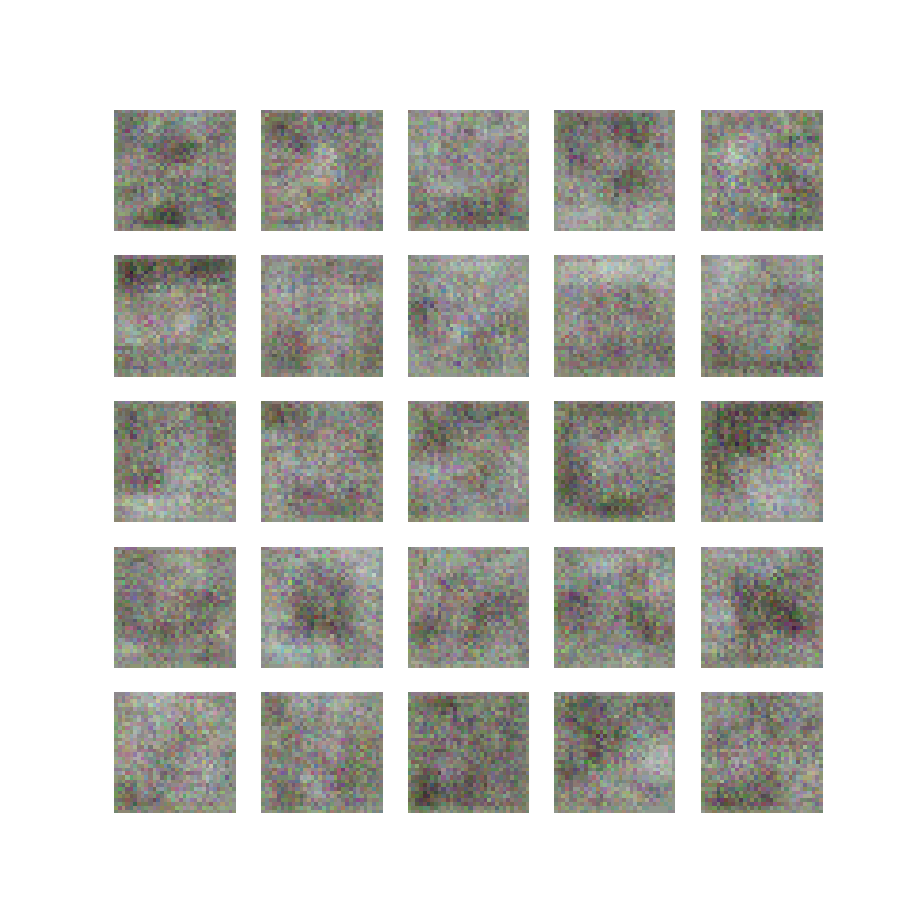
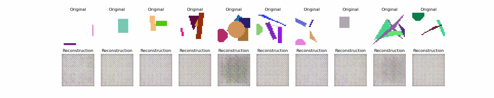
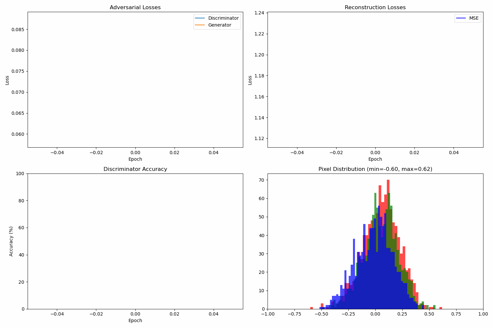

# BiGAN Implementation (Bidirectional Generative Adversarial Network)

This project implements a Bidirectional Generative Adversarial Network (BiGAN) based on the paper ["Adversarial Feature Learning"](https://arxiv.org/abs/1605.09782) by Donahue et al.

## Description

The BiGAN is an extension of the GAN (Generative Adversarial Network) that adds an encoder allowing the mapping of real data to the latent space. This bidirectional architecture enables:

1. Generation of new data (like a classic GAN)
2. Inference, i.e., the projection of real data into the latent space
3. Unsupervised learning of useful representations

## Project Structure

- `bigan_improved_colors.py`: Simplified BiGAN implementation for image reconstruction and anomaly detection
- `run_custom_training.py`: Script for training BiGAN on custom image datasets
- `BiGAN-based-Anomaly-Detector/`: Full implementation of BiGAN for anomaly detection
- `requirements.txt`: List of dependencies

## Recent Updates

- Removed color fidelity-specific components to create a simplified, cleaner implementation
- Streamlined the generator architecture
- Improved error handling for tensor operations
- Updated the output directory structure and visualization tools
- Added custom training script for using your own image datasets

## Installation

```bash
pip install -r requirements.txt
```

## Usage

### Training on the CIFAR-10 dataset

To train the simplified BiGAN model on CIFAR-10:

```bash
python bigan_improved_colors.py
```

The model will train on the CIFAR-10 dataset and save results to the `bigan_output/` directory.

### Training on your own images

To train on your own custom image dataset:

```bash
python run_custom_training.py --img_dir /path/to/your/images --epochs 100 --batch_size 64 --device mps
```

#### Custom Training Options

```
options:
  --img_dir IMG_DIR       Directory containing training images
  --epochs EPOCHS         Number of training epochs (default: 50)
  --batch_size BATCH_SIZE Training batch size (default: 16)
  --device {cpu,gpu,mps,cuda}
                          Device to use for training (default: cpu)
  --beta BETA             Weight factor for reconstruction loss (default: 1.0)
  --image_size IMAGE_SIZE Size to resize images to (default: 32)
  --save_dir SAVE_DIR     Directory to save results (default: bigan_custom_output)
  --save_interval SAVE_INTERVAL
                          Epoch interval for saving results (default: 10)
  --subset_ratio SUBSET_RATIO
                          Ratio of dataset to use (default: 1.0)
```

## BiGAN Architecture

The BiGAN comprises three main components:
- **Generator (G)**: Transforms a latent vector z into generated data G(z)
- **Encoder (E)**: Encodes real data x into latent vectors E(x)
- **Discriminator (D)**: Tries to distinguish between the pairs (x, E(x)) and (G(z), z)

## Results Visualization

The training process generates several visualizations:
- Generated samples at different epochs
- Reconstruction quality comparisons
- Training curves for all loss components

### Latest Training Results

#### Training Curves
![Training Curves]
<p align="center">
  
</p>
### Training Evolution

#### Generated Samples Evolution
<p align="center">
  
</p>

#### Reconstruction Evolution
<p align="center">
  
</p>

#### Training Curves Evolution
<p align="center">
  
</p>

The animations above show:
1. **Generated Samples**: Evolution of the generator's ability to create realistic images
2. **Reconstruction**: Improvement in the model's reconstruction capabilities over time
3. **Training Curves**: Progression of various loss components during training

## License

MIT License 